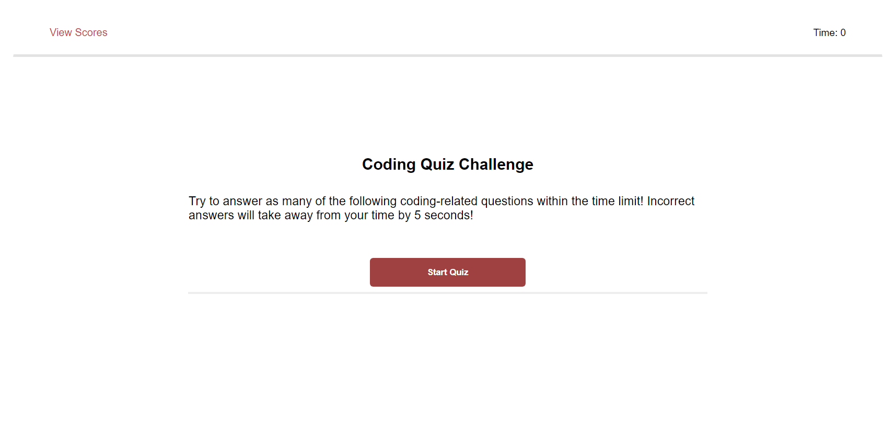
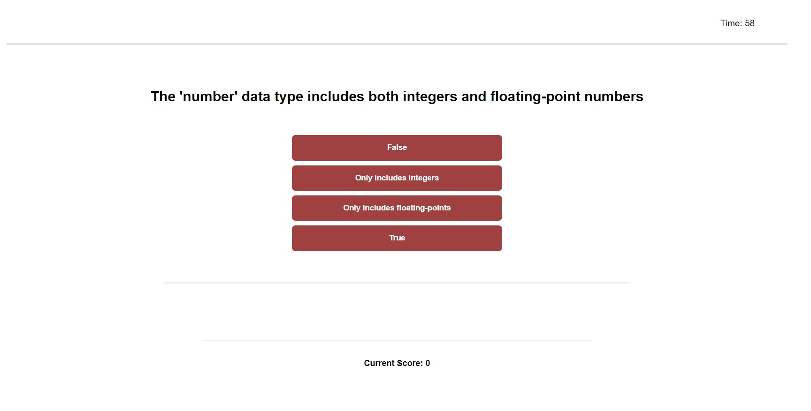
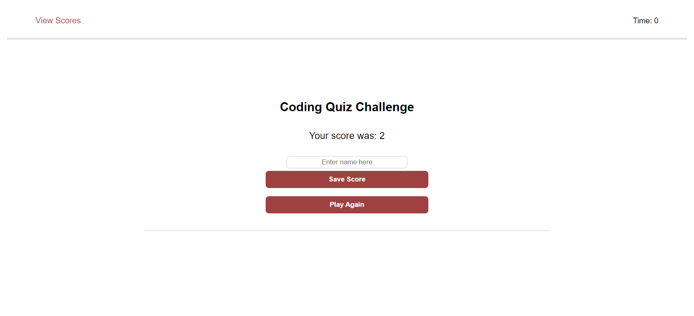
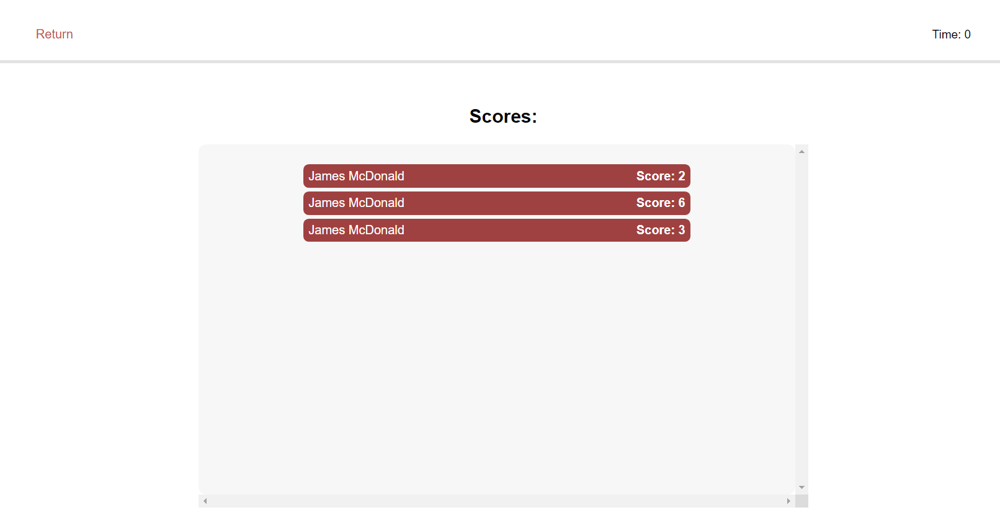

# <Password Generator>

## Description
As a learning web developer, it is crucial to repeatedly reinforce your knowledge of different JavaScript arguments. One effective method for developing this skill is to complete a quiz that asks challenging questions, and try to beat your current highscore.

As an aspiring web developer, I have worked to build upon a website that picks one of 25 random JavaScript related questions. To achieve this, I built a new website from scratch, using HTML and CSS as a baseplate whilst working on the logic and functionality in JavaScript.

I aim to create a responsive, user-friendly quiz that allows users to reinforce basic/intermediate concepts found within JavaScript. This will assist them in strengthening their knowledge and maintain a higher level of skill for future endeavours.

## Installation

N/A

## Usage

Upon visiting the website, users are greeted with a title page displaying a "Start Quiz" button. Clicking the button triggers a generation of one randomly chosen question along with four possible answers. Meanwhile, a countdown timer begins ticking down from 60 seconds to 0. Among the provided answers, only one is correct, requiring the user to identify the false statements. Selecting a wrong answer results in a deduction of 5 seconds from the player's remaining time, thereby reducing their potential score, while selecting a right answer will increase the score by 1. Selecting an answer, no matter the result, will generate a new question.

Once the timer reaches 0, the game finishes, and the user is presented with two options: a "Play Again" button and a "Save Score" button, accompanied by a name input field. Choosing the "Play Again" button restarts the game without saving the user's score, allowing them to play another round. On the other hand, selecting the "Save Score" button enables the user to store their score on a leaderboard that contains locally stored names. Once in the leaderboard area, the user may exit back to the play again page any time.

Participants have the freedom to replay the quiz as many times as they desire, aiming to improve their performance and climb the leaderboard - all the while learning/reinforcing JS concepts.

## Credits

N/A

## License

Refer to the LICENSE in the repo (MIT).

## Features

When quiz starts, timer goes down and the user is presented with a question.
When a question is answered, the user is presented with another question.
When a question is answered incorrectly, -5 time is subtracted from the clock.
When the timer reaches 0, the game is over.
When the game is over, users can save their name and score.
Ease of access.
Functional.
Simple design.

## Images

## Link

GitHub: https://github.com/jujusoi/JM-Module4-Challenge

GitHub Pages: https://jujusoi.github.io/JM-Module4-Challenge/
